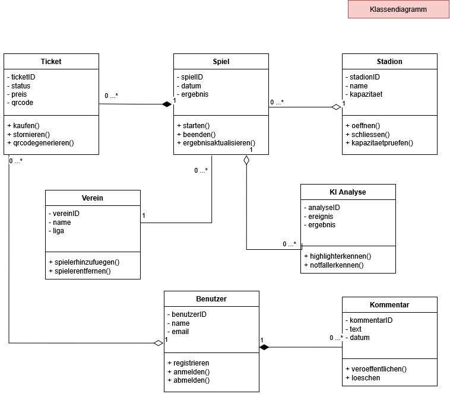
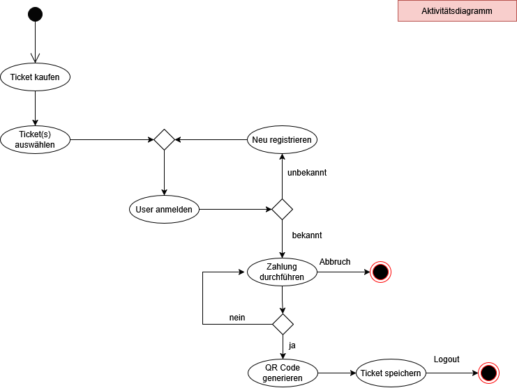
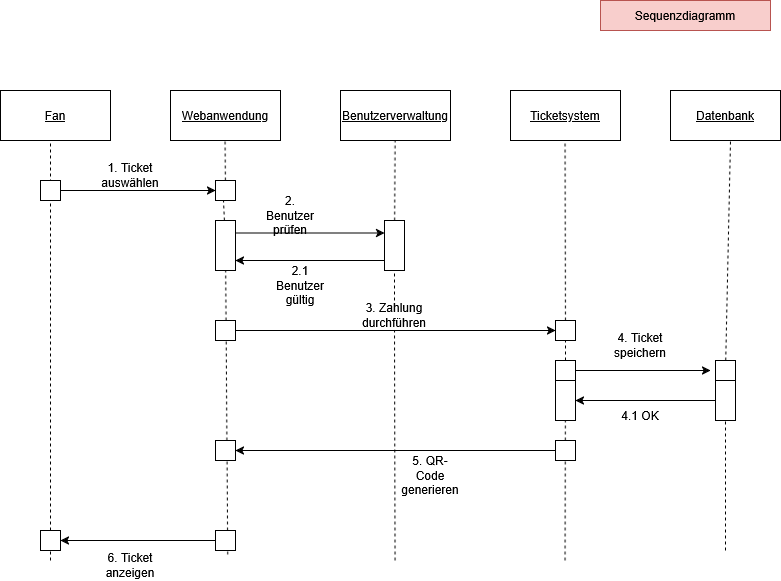
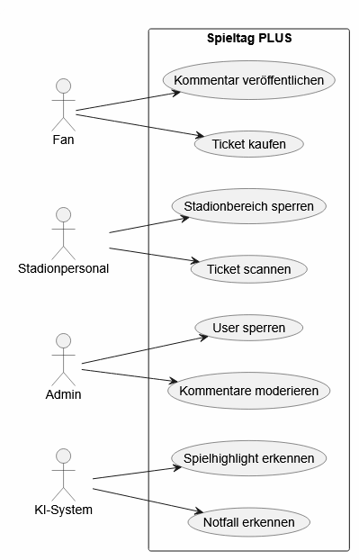
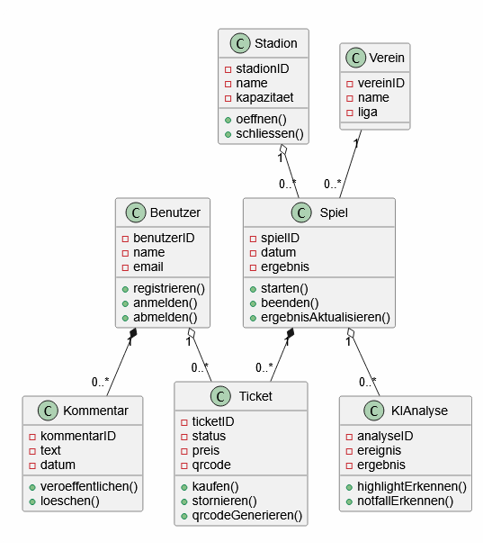

# TEIL A

# SpieltagPLUS-UMLs

## 1. Use-Case-Diagramm

Das Use-Case-Diagramm zeigt die wichtigsten Akteure und Funktionen der Plattform Spieltag-PLUS.

### Akteure
- Fan
- Stadionpersonal
- Admin
- KI-System

### Zentrale Funktionen
- Ticketkauf
- Stadionzugang
- Sicherheitsüberwachung
- Community-Funktionen
- KI-Analysen

### Schwierigkeiten / Imperfektion

Eigentlich keine, nur musste im Vorwege entschieden werden, wie viele USe Cases sinnvoll sind, ohne das Diagramm zu überladen.

## 2. Komponentendiagramm

Das Komponentendiagramm zeigt die wichtigsten Softwaresysteme von Spieltag-PLUS und deren Abhängigkeiten.
Als Komponenten habe ich unter Beachtung des "Think Big" nicht einzelne Klassen gezeichnet, sondern größere Bausteine der Plattform.

### Komponenten

- Webanwednung
- Mobile-App
- Ticketing-System
- Community-System
- KI- & Analytics-Service
- Sicherheits-Service
- Benutzerverwaltung
- Datenbank

### Schwierigkeiten / Imperfektion

Für mich viel komplexer als das Use-Case-Diagramm. Mir war von vornherein nicht klar, welche Komponenten benötigt werden und wie sei miteinander kommunizieren und wie die APIs und Artefakte einbezogen werden können.
Während des Zeichnens kam aber Schritt für Schritt die Erkenntnis und am Ende ein vereinfachtes, aber sinnvolles Diagramm.

# 3. Klassendiagramm

## Enthaltene Klassen

- Benutzer
- Ticket
- Spiel
- Stadion
- Verein
- Kommentar
- KI Analyse

## Verwendete UML-Elemente: Komposition / Aggregation / Assoziation und Kardinalitäten

### Erklärung Beziehungen

Komposition

Spiel ♦── Ticket

Ein Ticket existiert nur im Kontext eines bestimmten Spiels.
Findet das SPiel nicht statt, verfällt das Ticket für diese spezielle Spiel mit diesem speziellen Datum.

Benutzer ♦── Kommentar

Kommentare gehören zu einem Benutzer und werden von diesem erstellt.
Falss Benutzer gelöscht wird, ist auch sien Kommentar weg.

Aggregation

Stadion ◇── Spiel

Ein Stadion kann mehrere Spiele austragen.

Spiel ◇── KI Analyse

Zu einem Spiel können mehrere Analysen erzeugt werden.

Benutzer ◇── Ticket

Ein Benutzer besitzt 0 oder mehr Tickets.

Assoziation

Verein ─── Spiel

Ein Verein hat mehrere Spiele.

### Schwierigkeiten / Imperfektion

Die größte Herausforderung bestand hier bei den Beziehungen zwischen den Klassen. Insbesondere die Unterschiede zwischen Assoziation, Aggregation und Komposition waren nicht immer eindeutig. Ich war auch erst unsicher, ob Tickets Teil eines Spiels sind. Habe mich aber dann dafür entschieden. Ohne Spiel kein Ticket, aber auch ohne Ticket kein Spiel für die Person.

# 4. Aktivitätsdiagramm

## Ziel

 UML-Aktivitätsdiagramm: Es beschreibt den Ablauf eines Ticketkaufs vom Auswählen eines Tickets bis zur erfolgreichen Speichern eines Tickets.

## Ablauf

1. Ticket auswählen
2. Benutzer anmelden
3. Falls der Benutzer unbekannt ist, Registrierung durchführen
4. Zahlung durchführen
5. Zahlung prüfen
6. QR-Code generieren
7. Ticket speichern
8. Prozess beenden

## Verwendete UML-Elemente

- Startknoten
- Endknoten
- Aktivitäten
- Kontrollflüsse
- Entscheidungsknoten
- Schleife

## Diagramm

### Schwierigkeiten / Imperfektion
Anfangs hatte ich den Ablauf des Ticketkaufs sehr linear modelliert. 
Erst später kamen die alternativen Pfade der Registrierung und Anmeldung und die Prüfung der Zahlung hinzu. Dadurch entstand meiner Meinung nach ein realitätsnäheres Diagramm mit Entscheidungen und Schleifen.

# 5. Sequenzdiagramm

## Beteiligte Objekte

- Fan
- Webanwendung
- Benutzerverwaltung
- Ticketsystem
- Datenbank

## Nachrichtenfluss

1. Fan wählt ein Ticket aus.
2. Die Webanwendung prüft den Benutzer über die Benutzerverwaltung.
3. Nach erfolgreicher Prüfung wird die Zahlung durchgeführt.
4. Das Ticketsystem speichert das Ticket in der Datenbank.
5. Das Ticketsystem generiert einen QR-Code.
6. Die Webanwendung zeigt das Ticket dem Fan an.

## Verwendete UML-Elemente

- Lifelines
- Aktivierungsbalken
- Nachrichten
- Rückgabenachrichten
- Zeitliche Reihenfolge
  
## Diagramm

### Schwierigkeiten / Imperfektion
Hier habe ich eng am Skript gearbeitet. Dieses Diagramm war zunächst ungewohnt, da hier nicht die Struktur, sondern die zeitliche Kommunikation zwischen Objekten dargestellt wird. 
Insbesondere die Aktivierungsbalken und Rückgabepfeile mussten anhand der Vorlesungsbeispiele verstanden werden. Fand ich am schwierigsten von allen Diagrammen.

# TEIL B (GenAI / PlantUML)

## Ziel

Zusätzlich zu den manuell erstellten UML-Diagrammen wurden Diagramme mit Hilfe einer KI textbasiert erzeugt. Hierfür wurde PlantUML verwendet.

## Verwendetes Werkzeug

- PlantUML
- Generative KI zur Erzeugung des UML-Quellcodes (ChatGPT)

## 1. KI-generiertes Use-Case-Diagramm

Prompt: "Erzeuge ein UML Use-Case-Diagramm für die Plattform Spieltag PLUS.

Akteure:
- Fan
- Stadionpersonal
- Admin
- KI-System

Use Cases:
- Ticket kaufen
- Kommentar veröffentlichen
- Ticket scannen
- Stadionbereich sperren
- Kommentare moderieren
- User sperren
- Notfall erkennen
- Spielhighlight erkennen

Verbinde die Akteure mit den passenden Use Cases.
Nutze PlantUML."

Das Diagramm wurde anhand eines Textprompts automatisch erzeugt und anschließend mit PlantUML visualisiert.

## 2. KI-generiertes Klassendiagramm

Prompt:
"Erzeuge ein UML Klassendiagramm für Spieltag PLUS.

Klassen:
- Benutzer
- Ticket
- Spiel
- Stadion
- Verein
- Kommentar
- KIAnalyse

Füge Attribute und Methoden hinzu.

Beziehungen:
- Benutzer besitzt Tickets
- Benutzer erstellt Kommentare
- Spiel enthält Tickets
- Stadion beherbergt Spiele
- Verein nimmt an Spielen teil
- Spiel erzeugt KIAnalysen

Nutze PlantUML."

## Erkenntnisse

- UML-Diagramme lassen sich sehr schnell aus Textbeschreibungen erzeugen.
- Beim einfachere Use-Case-Diagramm ist alles korrekt dargestellt.
- Das komplexere Klassendiagramm ist auch sehr gut gelungen, hier fehlen nur die Methoden in der Klasse Verein.
- Die Assotiationen sind zu meinem Erstaunen alle korrekt, genauso wie manuell von mir erstellt. 
- PlantUML eignet sich gut für eine Text-First-Modellierung.

## Fazit

Die Kombination aus Generativer KI und PlantUML ermöglicht eine schnelle Erstellung von UML-Diagrammen. Die Ergebnisse müssen selbstverständlich geprüft werden, sind aber erstaunlich deckungsgleich mit den manuellen Ergebnissen.

