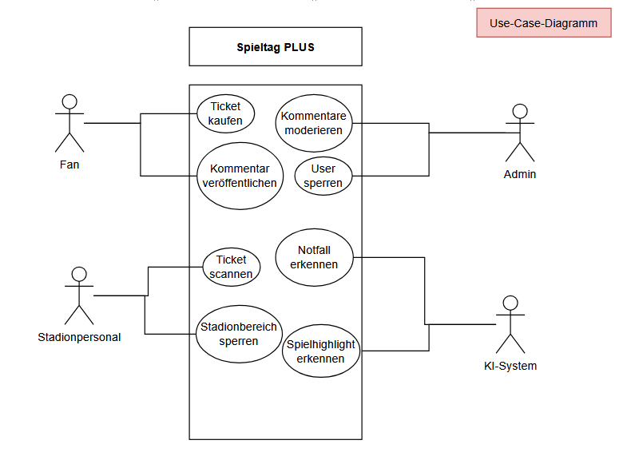
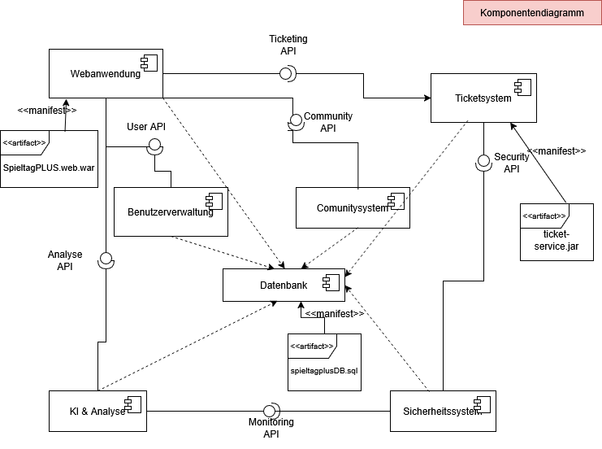

# Spieltag-PLUS-UML
UML Diagramme zum Projekt Spieltag PLUS

## Use-Case-Diagramm

Das Use-Case-Diagramm zeigt die wichtigsten Akteure und Funktionen der Plattform Spieltag-PLUS.

### Akteure
- Fan
- Stadionpersonal
- Admini
- KI-System

### Zentrale Funktionen
- Ticketkauf
- Stadionzugang
- Sicherheitsüberwachung
- Community-Funktionen
- KI-Analysen

## Komponentendiagramm

Das Komponentendiagramm zeigt die wichtigsten Softwaresysteme von Spieltag-PLUS und deren Abhängigkeiten.

### Komponenten

- Web-App
- Mobile-App
- Ticketing-System
- Community-System
- KI- & Analytics-Service
- Sicherheits-Service
- Benutzerverwaltung
- Datenbank

